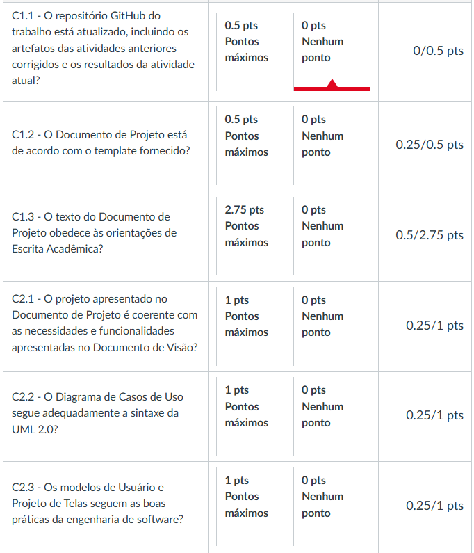
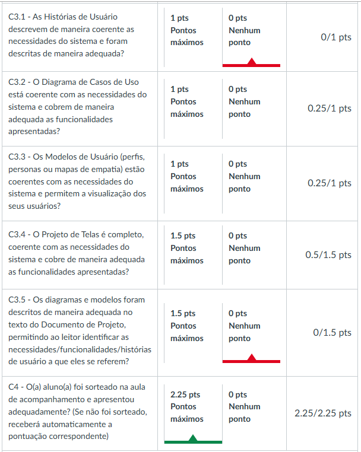
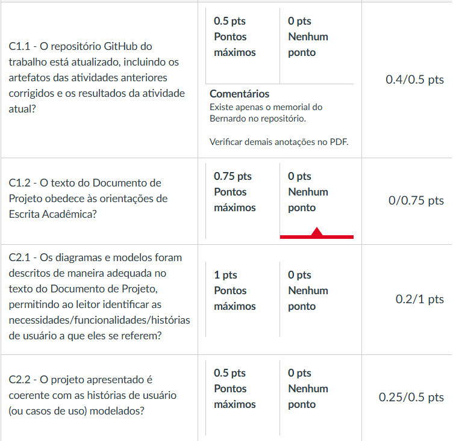
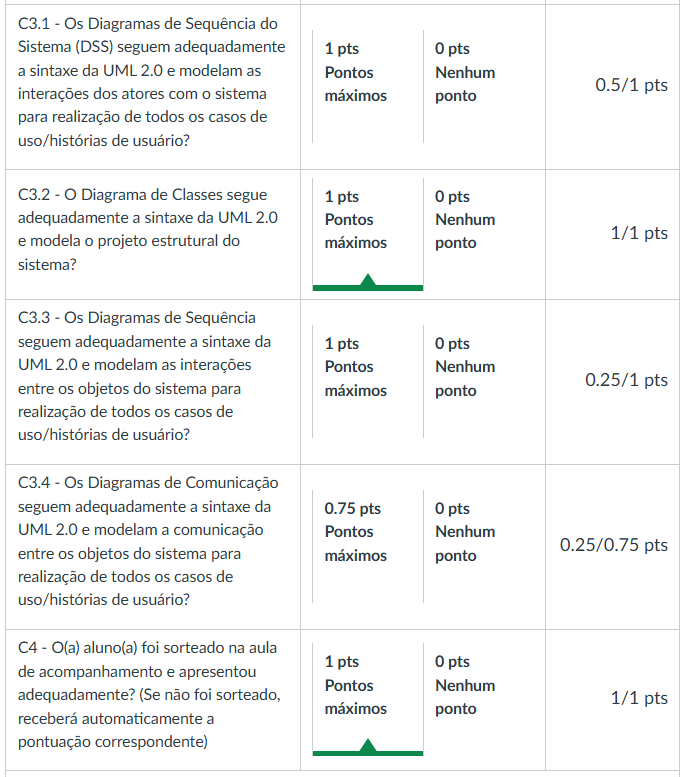
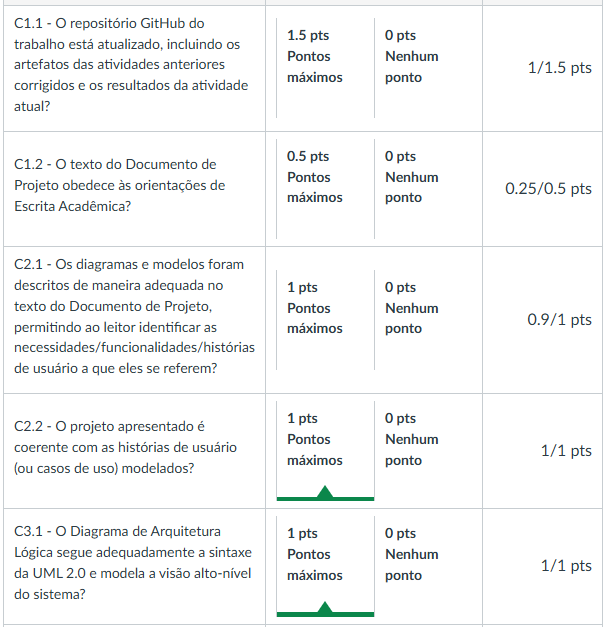
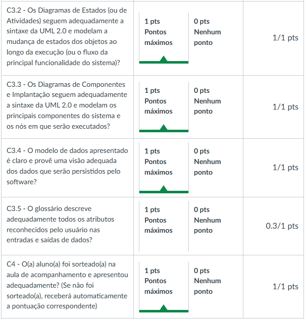
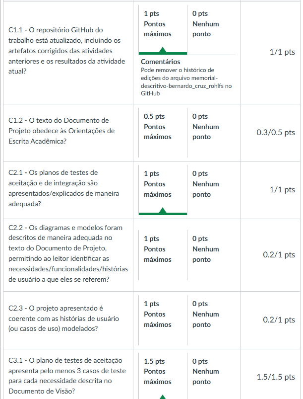
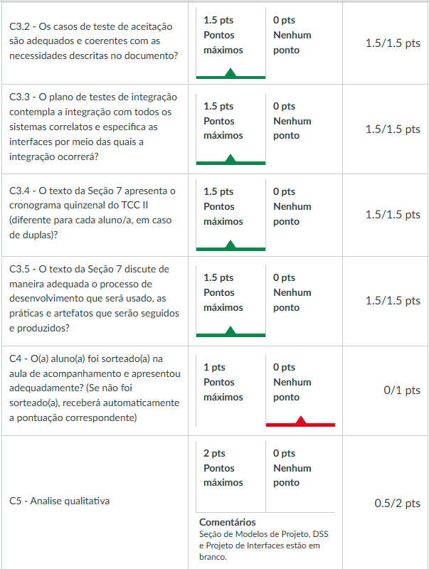

# Histórico de correções - TCC 01

## Entrega 01 ( Bernardo ) (2,38/2,5 pts)

Elaboração do Memorial Descritivo da Graduação (18 de agosto)

* `status: feito` COVID 19 -> COVID-19

* `status: feito` Rever a última frase do primeiro parágrafo, o mesmo aparenta estar incompleto e/ou dá a impressão de que falta algo a ser apresentado.

* `status: feito` "geral de 78%" -> geral de 78% de aproveitamento

* `status: feito` Definir sigla -> PUC Minas, CI/CD

* `status: feito` "e participará das aulas da universidade do Brasil simultaneamente, de forma síncrona.", " reforçando o interesse do aluno repasse de conhecimento" -> reformular, ficou confuso

* `status: feito` "Computação em Nuvem" -> remover iniciais maiúsculas

---

## Entrega 02 (7,65/10 pts)

Documento de Visão e Estudo de Viabilidade (8 de setembro) 

### Estudo de Viabilidade:

* `status: feito` Revisar termos em inglês devem estar em itálico. Ex. mobile

### Documento de Visão:

* `status: feito` Revisar o nome e qualificação dos professores de TCC1

* `status: feito` As regras de orientações de escrita ainda se aplicam. Sendo assim, realizem uma revisão ortográfica no texto. Alguns pontos importantes que devem ser revistos/corrigidos:
    * Parágrafos com apenas uma frase
    * Termos em inglês que não estejam em itálico. Ex: snacks.

* `status: feito` Na caracterização do escopo, gostei do início da discussão de sistemas atuais e concorrentes, uma das exigências para demonstrar que se trata de uma demanda inovadora. Porém, foi pouco explorado. Sendo assim, sugiro explorar um pouco mais essa discussão, apresentando exemplos concretos de que os sistemas atuais não exploram o que vocês pretendem. Desde a exemplificação de sistemas de vendas automáticas, até sistemas que realizam/focam mais na parte gerencial do negócio. Lembrando que vocês obrigatoriamente precisam fazer esse "estudo de campo" para a devida aprovação da demanda.

* `status: feito` Em fora do escopo, se não forem se preocupar, talvez seria interessante mencionar a respeito de hospedagem do produto.

* `status: feito` Explorar um pouco mais a justificativa das necessidades levantadas.

* `status: feito` Ao apresentar as funcionalidades, sugiro não mencionar aspectos de requisitos não funcionais, como "uma interface simples".

* `status: feito` Acredito que seja interessante mencionar funcionalidades relacionadas ao cadastro das informações.

* `status: feito` Explorar um pouco melhor a interligação com outros sistemas. Podem propor um sistema/api/plataforma para interligação e talvez, futuramente ajustar para uma similar. Apresente justificativa para o mesmo.

* `status: feito` Revisar a seção de restrições, deixando os elementos mais explícitos/diretos/quantificáveis.

---

## Entrega 03 (4,75/15 pts)

Interaction Design (user, UI, UX, IA, IxD) (29 de setembro)

* `status: feito` Caso não criem o repositório (pelo link fornecido) e realizem as correções fornecidas no Documento de Visão, a demanda será cancelada/reprovada.

* `status: feito` Documentação do projeto não está no github o que pode causar a reprovação da demanda.

* `status: feito` Faltam informações sobre atualizações das versões.

* `status: feito` Descrições em imagens estão muito pequenas e fogem ao padrão proposto.

* `status: feito` A introdução do trabalho não deixa claro o objetivo.

* `status: feito` Imagens não tem descrição de qual requisito e caso de uso estão atrelados.

* `status: feito` Funcionalidades do Funcionário do Bar me parecem muito simples e não agregam valor para o estabelecimento, pois faltam opções que devem existir para consulta, edição e exclusão de informações em caso de desistência, falhas de entrada ou mudanças solicitadas pelo usuário.

* `status: feito` 

    
    

---

## Entrega 04 (3,85/7,5 pts)

Modelagem de Comportamentos (13 de outubro)

* `status: feito`

    
    

---

## Entrega 05 (8,45/10 pts)

Modelagem de Estrutura e Persistência (27 de outubro)

### Repositório

* `status: feito` Falta o memorial do Eric

* `status: feito` Mover pasta UML para Artefatos

### Documento de Visão

* `status: feito` Adicionar o nome do Prof. Leonardo

* `status: feito` Coloque formatação de texto justificado

* `status: feito` Sugiro explorar melhor as necessidades, por exemplo, ter uma necessidade que foque na questão de pagamentos pelo aplicativo, prover um meio de acesso ao cardápio, etc. Talvez já esteja previamente explorado, existindo a necessidade de renomear algum dos que foram definidos.

* `status: feito` Cuidado com Restrições e RNF's.

* `status: feito` Em documentação, mencione a respeito da documentação de projeto.

* `status: feito` 

    
    

---

## Entrega 06 (10,7/15 pts)

Plano de Teste, Cronograma e Processo de Desenvolvimento (17 de novembro)

* `status: feito` 

    
    

